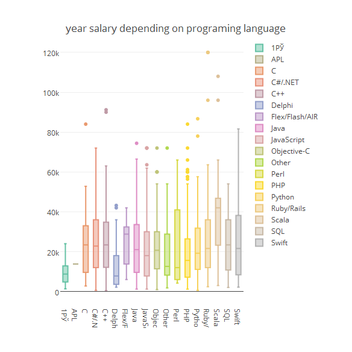

Presentation for coursera project developing data product
========================================================
author: "Mykyta Krychko"
date: "11 july 2017"
autosize: true

This info was taken from open source:

<https://github.com/devua/csv/tree/master/salaries>

Each year portal Developers of Ukraine is conducting a survey about salaries of ukrainian Developers.

<https://dou.ua/>

So I decide to share it information with you.

In this dataset was 4152 developers.

There are no any conclusions, just graphs. 

Popularity of IT positions in Ukraine 
========================================================

Popularity of programming languages in Ukraine 
========================================================

Year salary of developers depending on programing language in Ukraine 
========================================================

Year salaries of developers depends on age in Ukraine 
========================================================

